# 南信猫友记——软件设计说明书

> 南京信息工程大学 计算机与软件学院


---

## 第一章 研究背景与意义

### 1.1 编写目的

本文档旨在明确"南信猫友记"系统的研究背景、可行性及功能与非功能需求，为后续的概要设计、详细设计和编码实现提供依据。本文档的读者包括项目开发人员、测试人员及项目评审人员。

### 1.2 研究背景

#### 校园流浪猫的社会现状
近年来，高校校园流浪猫问题受到越来越多的关注。流浪猫在校园中自然繁殖，种群规模不断扩大，给校园生态环境和猫咪自身健康带来双重挑战。据相关调查，国内多数高校校园内均有数量不等的流浪猫群体，师生们自发投喂、救助的现象十分普遍。然而，由于缺乏统一的信息管理平台，猫咪的分布、健康状况、绝育状态等信息散落在各个社交媒体群组中，难以系统化管理和共享。

#### 高校已有的信息化尝试
部分高校已开始尝试用信息化手段管理校园猫咪。例如，中山大学基于开源项目"笃行猫谱"搭建了微信小程序端的校园猫咪信息平台，提供猫咪档案浏览、照片上传与审核、留言评论等基础功能。北京大学、清华大学等高校也有类似的校园猫咪社群和信息页面。这些实践证明了校园猫咪信息化管理的可行性和用户需求。

#### 本系统的项目来源
南京信息工程大学校园内也有大量的师生爱猫群体，他们自发记录和分享校园猫咪的信息。本校此前已参考中大猫谱搭建了微信小程序端猫咪平台，但小程序在页面承载能力、复杂算法运行和跨平台分享方面存在局限。因此，本系统作为 **Web 端的补充与升级** 立项，在保留核心猫咪信息管理功能的同时，引入推荐算法，提供更丰富的可视化展示和跨设备访问能力。

### 1.3 研究意义

#### 社会意义
在社会层面，本系统首先通过电子档案系统记录猫咪的空间分布、健康状况及绝育状态等信息，为校园流浪猫 TNR（抓捕-绝育-放归）救助工作提供数据支撑，从而提升校园猫咪的管理水平。其次，系统化的猫咪信息展示与互动功能能够引导更多师生关注校园流浪猫问题，增强关爱意识，促进人与动物的和谐共处。此外，猫咪话题作为校园社交的天然纽带，系统的留言、评分与关注等互动功能有助于增进师生之间的交流与连接，推动校园社区建设。

#### 技术意义
在技术层面，本系统将余弦相似度算法与内容推荐相结合，在猫咪信息管理场景中落地，验证了基于特征向量的推荐方法在小规模数据集上的实际效果，为推荐算法的实践应用提供了参考。系统采用 Spring Boot 与 Vue 3 的前后端分离架构，为后续同类 Web 应用的开发积累了技术经验。同时，本系统作为微信小程序端的 Web 补充，探索了多端协同的校园信息化解决方案，拓展了系统的跨设备访问能力。

### 1.4 研究现状

#### 国内外同类系统调研

**表1-1 国内外同类系统对比**

| 系统名称 | 所属高校 | 平台 | 核心功能 | 特色 | 不足 |
|----------|----------|:----:|----------|------|------|
| 笃行猫谱（中大猫谱） | 中山大学 | 微信小程序 | 猫咪档案、照片审核、留言、点赞 | 照片审核流程完善；开源项目 | 无推荐算法；页面承载受限 |
| 燕园猫速查手册 | 北京大学 | Web 页面 | 猫咪名录、位置标记 | 猫咪覆盖全；信息更新及时 | 无互动功能；无算法推荐 |
| THU 小喵 | 清华大学 | 微信小程序 | 猫咪地图、投喂记录 | 地图可视化 | 功能单一；无社交互动 |
| 本校现有小程序 | 南京信息工程大学 | 微信小程序 | 猫咪档案、照片上传、留言 | 基于中大猫谱二次开发 | 同中大猫谱局限 |

#### 现有系统的共性不足
通过对现有同类系统的调研分析，可以发现它们存在以下共性不足。其一，**缺乏智能推荐功能**——现有系统均以基础的档案浏览和搜索为主，未引入内容推荐算法，用户无法发现与自身兴趣相关的猫咪。其二，**互动维度单一**——多数系统仅支持留言和点赞功能，缺少评分、关注等多维度互动机制。其三，**Web 端覆盖不足**——多数校园猫咪平台集中在小程序端，Web 端系统较少，跨设备访问存在不便。其四，**数据利用不充分**——用户行为数据（浏览、搜索、互动等）尚未被充分采集和利用，无法为运营决策和算法优化提供支持。

#### 本系统的创新点
针对上述不足，本系统在以下方面实现了创新。在算法层面，系统引入基于余弦相似度融合热度因子的内容推荐算法，在猫咪详情页推荐相似猫咪。在互动层面，系统设计了猫德、颜值、社交、干饭、活力五个维度的评分体系，丰富了用户互动维度。在平台层面，系统提供了完整的 Web 端猫咪信息管理、搜索浏览及社交互动功能，实现了全功能覆盖。在数据层面，系统自动记录用户行为日志，为推荐算法优化和运营决策提供数据驱动支持。

### 1.5 系统目标

本系统的核心目标是为校园猫咪建立完整的电子档案体系，记录猫咪的基本信息、照片及健康状况。系统提供猫咪搜索与浏览功能，方便用户查找感兴趣的猫咪，并基于余弦相似度的推荐算法在猫咪详情页推荐相似猫咪。此外，系统支持用户参与猫咪档案的建设，包括添加猫咪、上传照片、留言评论、关注猫咪及评分点赞。在管理层面，系统为管理员提供数据管理权限，涵盖照片审核与评论审核，并提供照片审核流程以确保照片质量与内容安全。同时，系统引入点赞、评分、关注等猫友互动机制，以增强用户参与度。

---

## 第二章 可行性分析

### 2.1 技术可行性

**表2-1 技术可行性分析**

| 方面 | 分析 | 结论 |
|:----:|------|:----:|
| 后端技术 | Spring Boot 3.x 是成熟的 Java Web 框架，社区活跃、文档丰富；JPA/Hibernate 提供完善的 ORM 支持；Maven 管理依赖便捷 | 可行 |
| 前端技术 | Vue 3 配合 Vite 构建工具，开发效率高；Composition API 代码组织清晰；Axios 封装 HTTP 请求成熟稳定 | 可行 |
| 数据库 | MySQL 8.0 是广泛使用的关系型数据库，支持事务、外键、索引等，完全满足中小规模数据存储需求 | 可行 |
| 推荐算法 | 余弦相似度是标准的相似度计算方法，算法复杂度低（O(n²)），在猫咪数量 ≤ 100 时计算时间可控制在 1 秒以内 | 可行 |
| 开发工具 | JDK 17、Maven、Node.js、VS Code / IntelliJ IDEA 均为免费或开源工具 | 可行 |

### 2.2 经济可行性

**表2-2 经济可行性分析**

| 项目 | 说明 | 预估费用 |
|:----:|------|:--------:|
| 开发工具 | JDK、Maven、VS Code、MySQL Community 均为免费 | ¥0 |
| 运行环境 | 开发阶段使用本地环境；部署可选择学校服务器或云主机（阿里云学生机约 ¥100/年） | ¥0 ~ ¥100/年 |
| 第三方服务 | 无需商业授权或付费 API | ¥0 |
| 人力成本 | 课程项目，开发人员为在校学生 | ¥0 |

**结论：** 系统开发及运行成本极低，经济上完全可行。

### 2.3 操作可行性

**表2-3 操作可行性分析**

| 方面 | 分析 |
|:----:|------|
| 用户操作 | Web 界面简洁直观，操作路径不超过 3 步；猫咪详情页、信息编辑页布局清晰；无需培训即可上手 |
| 浏览器访问 | 无需安装客户端，通过 Chrome / Edge / Firefox 等现代浏览器即可访问 |
| 管理员操作 | 管理操作（照片审核、评论管理）与日常操作在同一界面完成，学习成本低 |
| 部署维护 | Spring Boot 内置 Tomcat，java -jar 即可启动；数据库初始化脚本已提供 |

**结论：** 系统操作门槛低，用户和管理员均可快速上手使用。

### 2.4 法律可行性

**表2-4 法律可行性分析**

| 方面 | 分析 |
|:----:|------|
| 开源合规 | 参考的中大猫谱项目采用 MIT 开源协议，本系统在架构参考和功能借鉴上合规 |
| 内容合规 | 猫咪照片为师生自愿上传，不涉及个人隐私泄露；系统设置照片审核机制，确保内容安全 |
| 数据安全 | 用户密码采用 BCrypt 加密存储，API 请求通过 JWT Token 鉴权，保障数据安全 |
| 校园规范 | 系统内容聚焦校园猫咪信息管理，符合校园文化建设和学生社团活动的规范范围 |

**结论：** 项目在法律和校园规范层面均无明显风险。

---

## 第三章 需求分析

### 3.1 运行环境与限制

#### 运行环境
系统的运行环境配置如下：后端运行于 JDK 17 环境，搭配 MySQL 8.0 数据库；前端运行于现代浏览器（Chrome、Edge 或 Firefox）；整体开发框架采用 Spring Boot 3.4.5 与 Vue 3。

#### 条件与限制
系统的运行受到以下条件约束：本系统为 Web 应用，用户无需安装客户端，通过浏览器即可访问；但用户需保持网络连接以完成数据交互；图片资源采用本地文件系统存储，暂未接入对象存储服务。

### 3.2 用例图

系统参与者包括三类角色：访客（未登录用户）、已登录用户（含特邀用户 VERIFIED）、管理员（ADMIN）。各参与者拥有的用例如下图所示。

**图1-1 系统用例图**

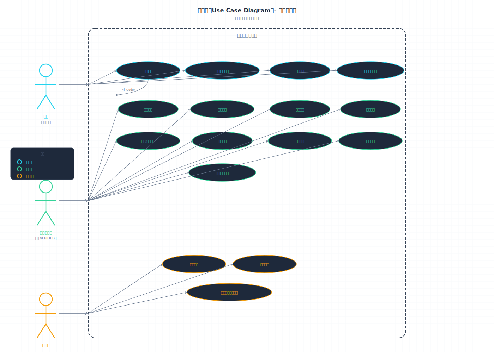

用例说明：

**表3-1 用例说明**

| 用例编号 | 用例名称 | 参与者 | 简要描述 |
|:--------:|----------|:------:|----------|
| UC01 | 注册账号 | 访客 | 填写用户名、密码、邮箱注册新账号 |
| UC02 | 浏览猫咪列表 | 访客、用户 | 按状态 Tab 分类、毛色分类浏览猫咪 |
| UC03 | 搜索猫咪 | 访客、用户 | 按关键词/条件搜索猫咪 |
| UC04 | 查看猫咪详情 | 访客、用户 | 查看猫咪信息、照片、留言及推荐 |
| UC05 | 用户登录 | 用户 | 输入用户名密码，获取 JWT Token |
| UC06 | 添加猫咪 | 用户 | 添加新的猫咪档案 |
| UC07 | 编辑/删除猫咪 | 用户 | 编辑或删除自己创建的猫咪档案 |
| UC08 | 上传照片 | 用户 | 上传猫咪照片（待审核） |
| UC09 | 点赞照片 | 用户 | 对已审核通过的照片点赞/取消 |
| UC10 | 发表评论 | 用户 | 在猫咪详情页发表留言评论 |
| UC11 | 关注猫咪 | 用户 | 关注/取消关注猫咪 |
| UC12 | 猫友评分 | 用户 | 从五个维度对猫咪进行 1-5 星评分 |
| UC13 | 管理个人信息 | 用户 | 查看和更新个人资料、头像 |
| UC14 | 审核照片 | 管理员 | 审核通过或拒绝用户上传的照片 |
| UC15 | 删除评论 | 管理员 | 删除违规评论 |
| UC16 | 管理任意猫咪档案 | 管理员 | 编辑或删除任意猫咪档案 |

### 3.3 功能分析

#### 3.3.1 功能划分

**表3-2 功能划分**

| 功能编号 | 功能模块 | 功能描述 |
|----------|----------|----------|
| F1 | 用户注册登录 | 用户注册账号、登录、退出登录；角色体系支持三级权限 |
| F2 | 猫咪信息管理 | 添加/编辑/删除猫咪档案（包含父母/好友关系字段） |
| F3 | 猫咪浏览搜索 | 浏览猫咪列表（支持状态 Tab 分类和毛色分类浏览）、按关键词搜索、按条件筛选、查看猫咪详情 |
| F4 | 猫咪详情展示 | 展示猫咪信息、照片、留言、评分、关注状态；展示相似猫咪推荐 |
| F5 | 照片管理 | 上传、审核、查看、删除照片；照片点赞 |
| F6 | 留言评论 | 发表、查看、删除留言 |
| F7 | 相似推荐（核心算法） | 基于余弦相似度计算猫咪之间的相似度，融合热度因子推荐相似猫咪 |
| F8 | 行为日志 | 记录用户浏览、搜索、点赞、评分等行为 |
| F9 | 关注猫咪 | 用户关注/取消关注猫咪，查看已关注列表 |
| F10 | 猫友评分 | 用户从五个维度（猫德、颜值、社交、干饭、活力）各给 1-5 星评分，统计平均分和评分人数 |

#### 3.3.2 功能描述

**F1 用户注册登录**

用户注册功能接受用户名、密码及邮箱作为输入。系统在注册时验证用户名的唯一性，并将密码经过 BCrypt 加密后存储于数据库中。登录功能则验证用户提交的用户名和密码，校验通过后返回 JWT Token 作为后续请求的鉴权凭证。系统的角色体系分为三级：USER（普通用户，可浏览猫咪信息、收藏、评分、上传照片及发表留言）、VERIFIED（特邀用户，可信度较高，其上传的照片可免审核或优先审核）以及 ADMIN（管理员，拥有系统的全部管理权限）。

**F2 猫咪信息管理**

该模块支持猫咪档案的添加、编辑与删除操作。输入信息涵盖猫咪名称、毛色、性格标签、活动位置、性别及绝育状态等字段。新增记录时，系统将数据写入档案；编辑时更新对应的字段；删除时则级联清除与该猫咪关联的评论、照片及关注记录。此外，系统支持记录猫咪的亲缘关系，包括父亲、母亲及好友关联。在权限控制方面，任何已登录用户均可添加猫咪档案，但仅创建者和管理员有权编辑或删除。

**F3 猫咪浏览搜索**

系统提供四种浏览与搜索方式。其一，首页猫咪列表按状态（在校、待领养、失踪、离世）分 Tab 分类展示，支持横向切换与触底分页加载。其二，关键词搜索可根据猫咪名称或昵称进行模糊匹配。其三，条件筛选支持按位置、状态及毛色分类等条件组合查询。其四，毛色分类浏览按照狸花、奶牛、橘猫、纯色、玳瑁及三花等分类聚合展示猫咪。搜索结果以分页列表形式返回。

**F4 猫咪详情展示**

用户通过猫咪 ID 发起请求后，系统查询该猫咪的详细信息、照片列表及留言列表，同时调用算法引擎计算与之相似的猫咪，最终返回包含猫咪基本信息、照片、留言及 Top-5 相似猫咪推荐的聚合数据。

**F5 照片管理**

用户上传照片后，系统将图片文件保存至本地文件系统，并将记录状态置为 PENDING（待审核）。管理员审核通过后，照片状态变更为 APPROVED 并展示于前端页面；若审核拒绝，则填写拒绝原因并通知上传者。上传者或管理员可以删除照片。已审核通过的照片支持用户点赞与取消点赞，系统记录每张照片的点赞总数。权限分配方面，已登录用户可上传照片，管理员具有审核权限，任何已登录用户均可对已审核照片进行点赞。

**F6 留言评论**

用户可在猫咪详情页发表评论。系统校验评论内容非空后，将用户 ID、猫咪 ID 及评论内容关联写入数据库，并返回写入成功的记录。评论列表按时间倒序排列展示。

**F7 相似推荐（核心算法）**

该模块是系统的核心算法功能。输入为当前猫咪的 ID，系统依次执行以下步骤：首先，提取猫咪的特征属性，包括毛色标签、性格标签、活动位置及性别；其次，将这些分类特征通过 One-Hot 编码转换为数值向量；随后，计算当前猫咪与所有其他活跃猫咪之间的余弦相似度；最后，融合热度因子（包括点赞数、关注数及评分均分的加权值）得到综合推荐分数，并按降序排列输出 Top-N 相似猫咪列表。算法的详细实现参见详细设计说明书中的算法描述。

**F8 行为日志**

系统自动记录用户在平台上的各类操作行为，包括浏览猫咪详情页、搜索关键词、点赞照片、提交评分及关注猫咪等。日志记录包含用户 ID、目标猫咪 ID 及操作类型等信息，为后续的热度分析及推荐算法优化提供数据支持。

**F9 关注猫咪**

已登录用户可以对感兴趣的猫咪执行关注或取消关注操作。关注操作记录用户与猫咪之间的关联关系，用户可在个人中心查看已关注的猫咪列表。关注数量作为热度因子之一，被纳入推荐算法的综合评分计算中。

**F10 猫友评分**

已登录用户可从猫德、颜值、社交、干饭、活力五个维度分别对猫咪进行 1 至 5 星的评分。系统对同一用户在同一猫咪上的评分采用覆盖机制，仅保留最新一次评分结果。系统实时统计每只猫咪在各维度上的平均分及评分总人数，评分均分作为热度因子参与推荐算法的融合计算。

### 3.4 性能分析

**表3-3 性能指标**

| 性能指标 | 要求 |
|----------|:----:|
| 页面响应时间 | 不超过 2 秒 |
| 相似度计算响应时间 | 不超过 1 秒（猫咪数量 ≤ 100 时） |
| 并发支持 | 至少支持 50 人同时访问 |
| 登录响应时间 | 不超过 500 ms |
| 列表查询响应时间 | 不超过 300 ms |

### 3.5 非功能需求

#### 安全性需求

在安全性需求方面，密码使用 BCrypt 加密存储，API 请求使用 JWT Token 鉴权，数据库密码和 JWT 密钥不硬编码在代码中。


#### 可用性需求

在可用性需求方面，界面简洁直观，操作路径不超过 3 步，猫咪详情页和信息编辑页布局清晰。


#### 可维护性

在可维护性方面，后端采用分层架构（Controller → Service → Repository），算法模块独立封装，便于替换和升级。


综上所述，本系统在技术、经济、操作及法律层面均具备可行性。功能需求分析完整覆盖了从用户注册到算法推荐的十个核心功能域，性能指标明确，非功能需求完善，为后续概要设计与详细设计奠定了坚实的基础。

---

## 第四章 概要设计

### 4.1 编写目的

本文档旨在描述"南信猫友记"系统的概要设计。系统基于已有的微信小程序校园猫平台（中大猫谱）进行 Web 端扩展，新增推荐算法等核心功能。本文档从系统架构层面规划模块划分、数据库概念设计及系统交互流程，为后续详细设计与编码实现提供技术蓝图。系统共划分为 9 个功能模块，涉及 8 张数据库实体表的存储与关联设计。

### 4.2 功能模块图

#### 2.1 模块划分总图

系统共分 9 个一级功能模块（M1-M9），每个一级模块包含若干二级子模块。功能模块图如下：

```
南信猫友记系统【第一层】
├── M1 用户管理模块【第一层】
│   ├── M1.1 用户注册【第二层】
│   ├── M1.2 用户登录（JWT 鉴权）【第二层】
│   ├── M1.3 用户信息管理【第二层】
│   └── M1.4 角色权限（USER / VERIFIED / ADMIN）【第二层】
├── M2 猫咪管理模块【第一层】
│   ├── M2.1 猫咪档案管理（增/删/改）【第二层】
│   ├── M2.2 猫咪关系管理（父母/好友）【第二层】
│   └── M2.3 猫咪状态管理（在校/待领养/失踪/离世）【第二层】
├── M3 搜索浏览模块【第一层】
│   ├── M3.1 猫咪列表展示（分页，支持状态 Tab 切换）【第二层】
│   ├── M3.2 关键词搜索【第二层】
│   ├── M3.3 条件筛选（位置/状态/毛色分类）【第二层】
│   ├── M3.4 毛色分类浏览【第二层】
│   └── M3.5 猫咪详情展示【第二层】
├── M4 照片管理模块【第一层】
│   ├── M4.1 照片上传【第二层】
│   ├── M4.2 照片审核（管理员）【第二层｜管理操作】
│   ├── M4.3 照片删除【第二层】
│   └── M4.4 照片点赞/取消【第二层】
├── M5 评论管理模块【第一层】
│   ├── M5.1 发表评论【第二层】
│   ├── M5.2 查看评论【第二层】
│   └── M5.3 删除评论【第二层｜管理操作】
├── M6 算法推荐模块（核心）【第一层】
│   ├── M6.1 特征提取（原始特征读取）【第二层】
│   ├── M6.2 特征向量化（One-Hot 编码）【第二层】
│   ├── M6.3 余弦相似度计算【第二层】
│   ├── M6.4 热度因子融合【第二层】
│   └── M6.5 排序输出（Top-N）【第二层】
├── M7 关注管理模块【第一层】
│   ├── M7.1 关注/取消关注【第二层】
│   └── M7.2 已关注列表查询【第二层】
├── M8 评分管理模块【第一层】
│   ├── M8.1 提交评分【第二层】
│   └── M8.2 评分统计【第二层】
└── M9 日志管理模块【第一层】
    ├── M9.1 行为日志记录【第二层】
    └── M9.2 热度数据统计【第二层】
```

#### 2.2 模块间调用关系

各模块之间存在明确的调用依赖关系，构成了完整的系统交互链路。搜索浏览模块（M3）在用户访问猫咪详情页时调用算法推荐模块（M6）获取相似猫咪推荐数据，同时调用日志管理模块（M9）记录用户的浏览与搜索行为。照片管理模块（M4）在处理点赞操作时调用日志管理模块（M9）记录行为，并将照片关联至猫咪管理模块（M2）对应的档案记录。评分管理模块（M8）与关注管理模块（M7）均在用户执行操作后调用日志管理模块（M9）记录评分与关注行为。算法推荐模块（M6）在计算推荐分数时，需要从日志管理模块（M9）获取热度统计数据（包括点赞数、关注数及评分均分）。上述调用关系确保了各模块间的数据流转畅通。

#### 2.3 需求功能与设计模块对应关系

为确保需求分析阶段定义的各项功能在设计中均有对应实现，以下给出功能与设计模块的映射关系。用户注册与登录功能（F1）由用户管理模块（M1）实现；猫咪信息管理（F2）对应猫咪管理模块（M2）；猫咪浏览搜索（F3）及详情展示（F4）由搜索浏览模块（M3）承担，其中详情展示需联合算法推荐模块（M6）提供相似推荐；照片管理（F5）对应照片管理模块（M4）；留言评论（F6）由评论管理模块（M5）实现；相似推荐（F7）是算法推荐模块（M6）的核心功能；行为日志（F8）由日志管理模块（M9）负责；关注猫咪（F9）对应关注管理模块（M7）；猫友评分（F10）对应评分管理模块（M8）。上述映射关系体现了从需求分析到概要设计的完整追溯链路。

---

### 4.3 数据库 E-R 图

#### 3.1 数据库总览

**数据库名称：** `nanxin_maopu_v2`

**共 8 张实体表：**

**表3-1 数据库表总览**

| 表名 | 说明 | 类型 |
|------|------|:----:|
| user | 用户表 | 基础数据 |
| cat | 猫咪表 | 基础数据 |
| photo | 照片表 | 基础数据 |
| comment | 评论表 | 基础数据 |
| activity_log | 行为日志表 | 日志数据 |
| photo_like | 照片点赞表 | 互动数据 |
| cat_follow | 猫咪关注表 | 互动数据 |
| cat_rating | 猫咪评分表 | 互动数据 |

#### 3.3 表字段定义

##### 3.3.1 user — 用户表

| 字段名 | 类型(长度) | 允许空 | 键 | 说明 |
|--------|------------|:------:|:--:|------|
| id | BIGINT | NO | PK | 自增主键 |
| username | VARCHAR(50) | NO | UNIQUE | 用户名 |
| password | VARCHAR(255) | NO | | BCrypt 加密后的密码 |
| nickname | VARCHAR(50) | YES | | 昵称 |
| email | VARCHAR(100) | YES | | 邮箱 |
| avatar | VARCHAR(255) | YES | | 头像 URL |
| role | ENUM('USER','VERIFIED','ADMIN') | NO | | 角色，默认 USER |
| status | TINYINT | YES | | 状态，1 正常 |
| last_login | DATETIME | YES | | 最后登录时间 |
| created_at | DATETIME | YES | | 创建时间 |
| updated_at | DATETIME | YES | | 更新时间 |

##### 3.3.2 cat — 猫咪表

| 字段名 | 类型(长度) | 允许空 | 键 | 说明 |
|--------|------------|:------:|:--:|------|
| id | BIGINT | NO | PK | 自增主键 |
| name | VARCHAR(50) | NO | | 猫咪名称 |
| nickname | VARCHAR(50) | YES | | 昵称/别名 |
| gender | ENUM('MALE','FEMALE','UNKNOWN') | YES | | 性别 |
| birth_year | INT | YES | | 出生年份 |
| breed | VARCHAR(50) | YES | | 品种 |
| colour | VARCHAR(50) | YES | | 毛色描述 |
| colour_tags | VARCHAR(100) | YES | | 毛色标签（分号分隔） |
| location_area | VARCHAR(50) | YES | | 所在校区/区域 |
| location_detail | VARCHAR(200) | YES | | 详细位置 |
| personality_tags | VARCHAR(200) | YES | | 性格标签（分号分隔） |
| personality_desc | TEXT | YES | | 性格详细描述 |
| health_status | VARCHAR(100) | YES | | 健康状况 |
| sterilized | BOOLEAN | YES | | 是否绝育 |
| adopt_status | ENUM('UNCLAIMED','ADOPTED','SEEKING') | YES | | 领养状态 |
| status | ENUM('ACTIVE','SEEKING_ADOPT','MISSING','DECEASED') | YES | | 在校/待领养/失踪/离世 |
| weight | DECIMAL(4,1) | YES | | 体重(kg) |
| cover_photo_id | BIGINT | YES | FK | 封面照片 ID |
| father_id | BIGINT | YES | FK→cat | 父亲 ID（自引用） |
| mother_id | BIGINT | YES | FK→cat | 母亲 ID（自引用） |
| friend_ids | VARCHAR(255) | YES | | 好友猫咪 ID 列表 |
| first_sighting_time | DATE | YES | | 首次发现日期 |
| first_sighting_location | VARCHAR(200) | YES | | 首次发现地点 |
| notes | TEXT | YES | | 备注 |
| like_count | INT | YES | | 点赞数（冗余） |
| follow_count | INT | YES | | 关注数（冗余） |
| rating_count | INT | YES | | 评分人数（冗余） |
| avg_rating | DECIMAL(3,2) | YES | | 平均评分 |
| creator_id | BIGINT | YES | FK | 创建者 ID |
| deleted | TINYINT | YES | | 软删除标记，0 正常 1 删除 |
| created_at | DATETIME | YES | | 创建时间 |
| updated_at | DATETIME | YES | | 更新时间 |

##### 3.3.3 photo — 照片表

| 字段名 | 类型(长度) | 允许空 | 键 | 说明 |
|--------|------------|:------:|:--:|------|
| id | BIGINT | NO | PK | 自增主键 |
| cat_id | BIGINT | NO | FK | 所属猫咪 ID |
| uploader_id | BIGINT | NO | FK | 上传者 ID |
| file_path | VARCHAR(255) | NO | | 文件存储路径 |
| file_path_compressed | VARCHAR(255) | YES | | 压缩图路径 |
| description | VARCHAR(200) | YES | | 照片描述 |
| sort_order | INT | YES | | 排序序号 |
| status | ENUM('PENDING','APPROVED','REJECTED') | YES | | 审核状态 |
| reviewer_id | BIGINT | YES | FK | 审核人 ID |
| reject_reason | VARCHAR(200) | YES | | 拒绝原因 |
| like_count | INT | YES | | 点赞数（冗余） |
| created_at | DATETIME | YES | | 上传时间 |

##### 3.3.4 comment — 评论表

| 字段名 | 类型(长度) | 允许空 | 键 | 说明 |
|--------|------------|:------:|:--:|------|
| id | BIGINT | NO | PK | 自增主键 |
| cat_id | BIGINT | NO | FK | 所属猫咪 ID |
| user_id | BIGINT | NO | FK | 评论者 ID |
| content | TEXT | NO | | 评论内容 |
| created_at | DATETIME | YES | | 评论时间 |

##### 3.3.5 activity_log — 行为日志表

| 字段名 | 类型(长度) | 允许空 | 键 | 说明 |
|--------|------------|:------:|:--:|------|
| id | BIGINT | NO | PK | 自增主键 |
| user_id | BIGINT | YES | FK | 用户 ID |
| cat_id | BIGINT | YES | FK | 猫咪 ID |
| action | ENUM('VIEW','SEARCH','COMMENT','LIKE','RATING','FOLLOW') | NO | | 操作类型 |
| extra_info | VARCHAR(500) | YES | | 额外信息 |
| created_at | DATETIME | YES | | 记录时间 |

##### 3.3.6 photo_like — 照片点赞表

| 字段名 | 类型(长度) | 允许空 | 键 | 说明 |
|--------|------------|:------:|:--:|------|
| id | BIGINT | NO | PK | 自增主键 |
| photo_id | BIGINT | NO | FK | 照片 ID |
| user_id | BIGINT | NO | FK | 点赞用户 ID |
| created_at | DATETIME | YES | | 点赞时间 |

> 唯一约束：UK(photo_id, user_id)，每人每照仅点赞一次

##### 3.3.7 cat_follow — 猫咪关注表

| 字段名 | 类型(长度) | 允许空 | 键 | 说明 |
|--------|------------|:------:|:--:|------|
| id | BIGINT | NO | PK | 自增主键 |
| user_id | BIGINT | NO | FK | 用户 ID |
| cat_id | BIGINT | NO | FK | 猫咪 ID |
| created_at | DATETIME | YES | | 关注时间 |

> 唯一约束：UK(user_id, cat_id)，每人每猫仅关注一次

##### 3.3.8 cat_rating — 猫咪评分表

| 字段名 | 类型(长度) | 允许空 | 键 | 说明 |
|--------|------------|:------:|:--:|------|
| id | BIGINT | NO | PK | 自增主键 |
| cat_id | BIGINT | NO | FK | 猫咪 ID |
| user_id | BIGINT | NO | FK | 评分用户 ID |
| r1 | INT | NO | CHECK(1-5) | 猫德评分 |
| r2 | INT | NO | CHECK(1-5) | 颜值评分 |
| r3 | INT | NO | CHECK(1-5) | 社交评分 |
| r4 | INT | NO | CHECK(1-5) | 干饭评分 |
| r5 | INT | NO | CHECK(1-5) | 活力评分 |
| created_at | DATETIME | YES | | 评分时间 |

> 唯一约束：UK(user_id, cat_id)，每人每猫仅保留最新评分

**图3-1 数据库E-R图**

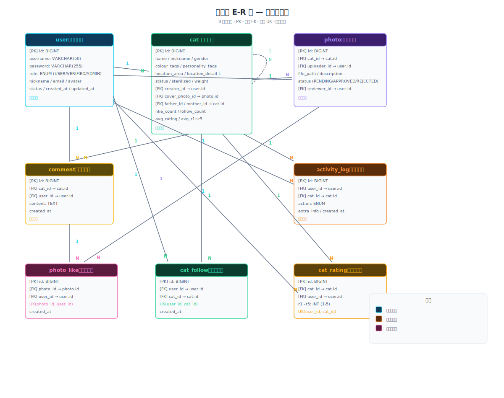

**实体关系说明：**

**表3-2 实体关系说明**

| 主实体 | 关系 | 从实体 | 外键 |
| user | 1 → N | photo | uploader_id / reviewer_id |
| user | 1 → N | comment | user_id |
| user | 1 → N | activity_log | user_id |
| user | 1 → N | photo_like | user_id |
| user | 1 → N | cat_follow | user_id |
| user | 1 → N | cat_rating | user_id |
| cat | 1 → N | photo | cat_id |
| cat | 1 → N | comment | cat_id |
| cat | 1 → N | activity_log | cat_id |
| cat | 1 → N | cat_follow | cat_id |
| cat | 1 → N | cat_rating | cat_id |
| photo | 1 → N | photo_like | photo_id |
| cat | 1 → N | cat | father_id / mother_id（自引用） |

**约束说明：**

`photo_like`：唯一约束 `UK(photo_id, user_id)`，确保每人每照仅点赞一次，`cat_follow`：唯一约束 `UK(user_id, cat_id)`，确保每人每猫仅关注一次，`cat_rating`：唯一约束 `UK(user_id, cat_id)`，确保每人每猫仅保留最新评分，`cat`：软删除标记 `deleted`（0 正常 / 1 已删除），数据物理保留。


---

### 4.4 时序图

#### 4.1 用户浏览详情页→推荐算法调用

**图4-1 推荐算法时序图**


**表4-1 推荐算法时序步骤**

| 步骤 | 调用方 | 被调用方 | 动作 |
|:----:|:------:|:--------:|------|
| 1 | 用户 | 浏览器 | 点击猫咪卡片 |
| 2 | 浏览器 | CatController | GET /cats/{id} |
| 3 | CatController | CatService | getCatDetail(catId) |
| 4a | CatService | MySQL | 查询猫咪基本信息 |
| 4b | CatService | MySQL | 查询照片列表 |
| 4c | CatService | MySQL | 查询留言列表 |
| 5 | CatService | CatController | 返回 CatDetailResponse |
| 6 | CatController | CatService | getRecommendations(catId) |
| 7 | CatService | CatSimilarityAlgorithm | recommend(catId, topN) |
| 8a | CatSimilarityAlgorithm | MySQL | 查询所有活跃猫咪的特征数据 |
| 8b | CatSimilarityAlgorithm | MySQL | 查询热度统计数据 |
| 9 | CatSimilarityAlgorithm | — | 算法计算（特征提取→One-Hot编码→余弦相似度→热度融合→排序） |
| 10 | CatSimilarityAlgorithm | CatService | 返回 RecommendResult 列表 |
| 11 | CatService | CatController | 聚合推荐数据到详情 |
| 12 | CatController | 浏览器 | JSON 响应 |
| 13 | 浏览器 | 用户 | 渲染猫咪详情页 + 推荐栏 |

#### 4.2 用户注册与登录（JWT 鉴权）

**图4-2 注册登录时序图**


**表4-2 注册流程步骤**

| 步骤 | 调用方 | 被调用方 | 动作 |
|:----:|:------:|:--------:|------|
| 1-2 | 用户→浏览器→AuthController | 提交注册信息 |
| 3 | AuthController | UserService | register(userData) |
| 4 | UserService | — | BCrypt 加密密码 |
| 5 | UserService | MySQL | INSERT INTO user |
| 6-8 | — | 逐层返回 | 注册成功响应 |

**表4-3 登录流程步骤**

| 步骤 | 调用方 | 被调用方 | 动作 |
|:----:|:------:|:--------:|------|
| 9-10 | 用户→浏览器→AuthController | 提交用户名密码 |
| 11 | AuthController | UserService | login(username, password) |
| 12 | UserService | MySQL | 查询用户记录 |
| 13 | UserService | — | BCrypt 校验密码 |
| 14 | UserService | JwtConfig | generateToken(userId, role) |
| 15 | JwtConfig | UserService | 返回 JWT Token |
| 16-18 | — | 逐层返回 | 200 OK（含 Token + 用户信息） |

---

---

## 第五章 详细实现

### 5.1 总体设计

#### 2.1 需求概述
本系统为校园流浪猫信息管理与推荐平台，提供猫咪档案管理、搜索浏览、照片审核、社交互动（点赞/关注/评分/留言）及基于余弦相似度的猫咪推荐功能。系统采用 B/S 架构，后端 Spring Boot 3.4.5 + Java 17，前端 Vue 3 + Vite，数据库 MySQL 8。

#### 2.2 软件结构

##### 2.2.1 后端分层架构
```
nanxin-catbook-backend/
├── controller/          # 控制层：接收 HTTP 请求，调用 Service
│   ├── AuthController
│   ├── CatController
│   ├── PhotoController
│   ├── CommentController
│   ├── FollowController
│   └── RatingController
├── service/             # 业务逻辑层：实现核心业务
│   ├── UserService
│   ├── CatService
│   ├── PhotoService
│   ├── CommentService
│   ├── FollowService
│   ├── RatingService
│   ├── LogService
│   └── CatSimilarityAlgorithm  # 核心算法引擎
├── repository/          # 数据访问层：数据库 CRUD
│   ├── UserRepository
│   ├── CatRepository
│   ├── PhotoRepository
│   ├── CommentRepository
│   ├── PhotoLikeRepository
│   ├── CatFollowRepository
│   ├── CatRatingRepository
│   └── ActivityLogRepository
├── entity/              # 实体类（对应数据库表）
├── dto/                 # 数据传输对象
├── config/              # 配置类（JWT、跨域等）
└── util/                # 工具类
```

##### 2.2.2 前端组件结构
```
frontend/src/
├── router/index.js          # 路由配置（9条路由）
├── api/index.js             # Axios 封装 + 全部 API 接口
├── stores/                  # Pinia 状态管理
├── views/
│   ├── Home.vue             # 首页：猫咪列表 + 状态 Tab + Bento Grid
│   ├── CatDetail.vue        # 详情页：照片轮播 + 信息 + 留言 + 推荐
│   ├── Search.vue
├── AddCat.vue          # 添加猫咪
├── EditCat.vue         # 编辑猫咪（含照片管理）
├── Login.vue           # 登录
├── Register.vue        # 注册
├── MyProfile.vue       # 个人中心
├── MyFollows.vue       # 我的关注           # 搜索页
│   └── About.vue            # 关于页
├── components/              # 可复用组件
├── App.vue                  # 主布局：浮动导航 + 页面过渡 + 页脚
└── style.css                # 全局样式系统
```

---

### 5.2 程序流程与接口

---

#### 3.1 M1 用户管理模块

##### 3.1.1 功能
实现用户的注册、登录、个人信息管理以及三级角色权限控制（USER、VERIFIED、ADMIN）。在性能方面，登录响应时间不超过 500 ms，注册响应时间不超过 1 s。

##### 3.1.2 处理流程
注册接口（`POST /auth/register`）接收用户名、密码及邮箱，系统首先校验用户名的唯一性，随后将密码经 BCrypt 哈希算法加密后写入数据库。登录接口（`POST /auth/login`）接收用户名与密码，系统查询用户记录并使用 BCrypt 验证密码，验证通过后由 JwtConfig 基于 HMAC-SHA256 签名算法生成有效期为 24 小时的 JWT Token。获取或更新个人信息（`GET/PUT /auth/me`）则通过解析请求头中携带的 Token 获取当前用户 ID，进而查询或更新数据库中的用户记录。上述流程的输出分别为注册结果、JWT Token 及用户基本信息（含用户 ID、用户名、昵称、邮箱、头像及角色）。

**图3-1 用户管理流程图**

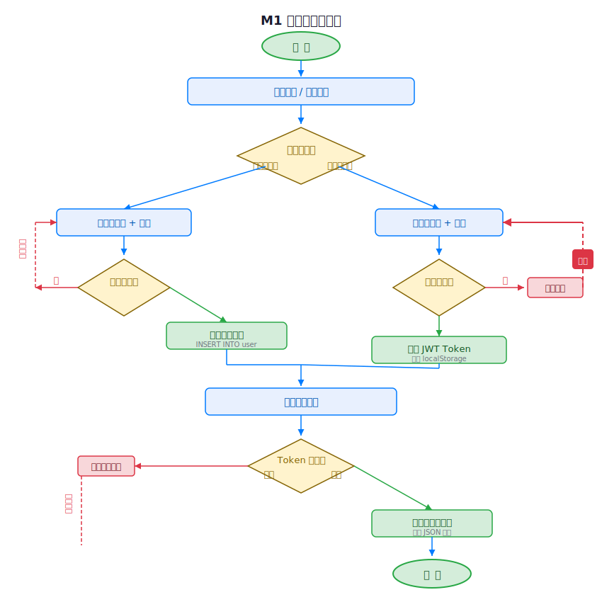

##### 3.1.7 接口
**表3-1 接口清单（M1 用户管理模块）**

| 方法 | 路径 | 权限 |
|------|------|------|
| POST | `/api/v1/auth/register` | ALL |
| POST | `/api/v1/auth/login` | ALL |
| GET | `/api/v1/auth/me` | LOGIN |
| PUT | `/api/v1/auth/me` | LOGIN |


---

#### 3.2 M2 猫咪管理模块

##### 3.2.1 功能
实现猫咪档案的增删改查，支持猫咪亲缘关系管理（父亲、母亲、好友）和状态管理。单次查询响应时间不超过 200 ms，写入操作不超过 500 ms。

##### 3.2.2 处理流程
系统的猫咪档案管理接受涵盖名称、毛色、性格标签、位置、性别、绝育状态等二十余个字段的输入。新增记录时（`POST /cats`），系统校验用户登录状态及必填字段后将数据写入数据库，其中创建者 ID 自动设为当前用户。编辑时（`PUT /cats/{id}`），系统校验当前用户是否为创建者或管理员，通过后更新对应字段。删除时（`DELETE /cats/{id}`），系统执行权限校验后实施级联删除，清除与该猫咪关联的评论、照片、关注及评分记录，并设置逻辑删除标记。输出为操作结果及猫咪的完整信息（JSON 格式，含关联数据）。

**图3-2 猫咪管理流程图**

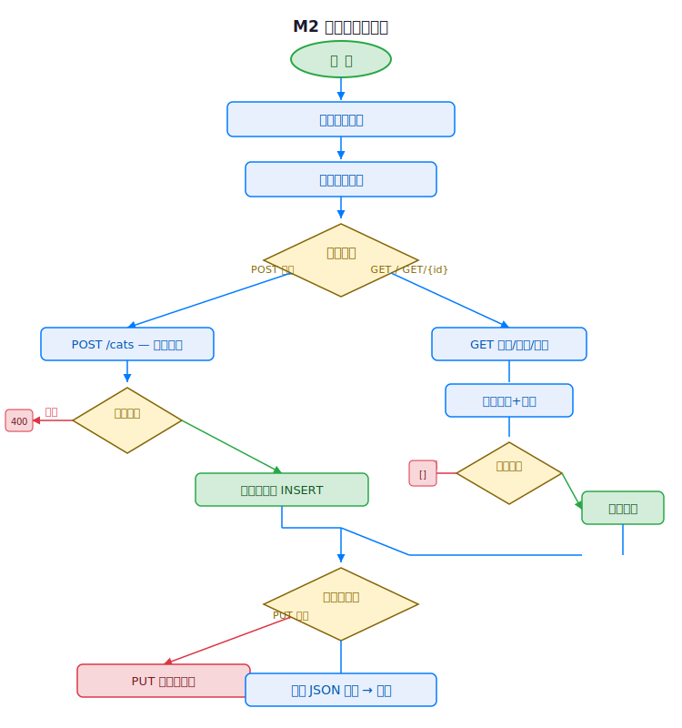

##### 3.2.6 接口
**表3-2 接口清单（M2 猫咪管理模块）**

| 方法 | 路径 | 权限 |
|------|------|------|
| GET | `/api/v1/cats` | ALL |
| GET | `/api/v1/cats/{id}` | ALL |
| POST | `/api/v1/cats` | LOGIN |
| PUT | `/api/v1/cats/{id}` | LOGIN（本人或ADMIN） |
| DELETE | `/api/v1/cats/{id}` | LOGIN（本人或ADMIN） |

---

#### 3.3 M3 搜索浏览模块

##### 3.3.1 功能
提供猫咪列表分页展示（支持状态 Tab 切换）、关键词搜索、条件筛选（位置、状态、毛色分类）及毛色分类浏览。列表查询响应时间不超过 300 ms，搜索结果排序不超过 500 ms。

##### 3.3.2 处理流程
系统接收搜索关键词、筛选条件（status、location_area、colour_tags）及分页参数（page、size）作为输入。后端控制器解析查询参数后，动态构建查询条件并调用 Repository 层执行分页查询，返回包含总条数、当前页及每页大小的猫咪分页列表。前端在切换状态 Tab 时重置页码为 0 并重新发起请求。

**图3-3 搜索浏览流程图**

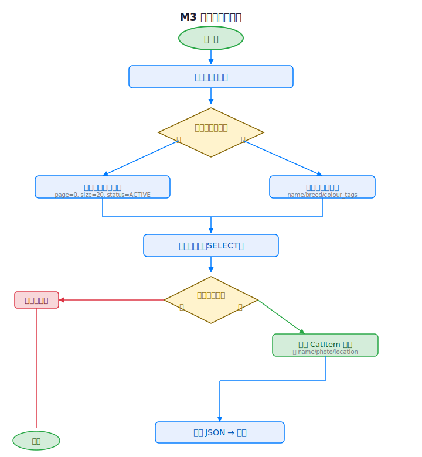

##### 3.3.6 接口
**表3-3 接口清单（M3 搜索浏览模块）**

| 方法 | 路径 | 权限 |
|------|------|------|
| GET | `/api/v1/cats?status=&keyword=&location_area=&page=&size=` | ALL |

#### 3.4 M4 照片管理模块

##### 3.4.1 功能
实现照片的上传、审核（PENDING→APPROVED/REJECTED）、删除及点赞/取消点赞。照片上传时间不超过 2 s（取决于文件大小），审核操作不超过 500 ms，点赞操作不超过 200 ms。

##### 3.4.2 处理流程
上传照片时，系统接收图片文件（支持 jpg/png 格式，最大 10 MB）、猫咪 ID 及照片描述，验证文件格式与大小后将文件保存至本地文件系统，同时在数据库中插入状态为 PENDING 的记录。管理员通过审核接口（`PUT /photos/{id}/approve` 或 `/reject`）将照片状态变更为 APPROVED 或 REJECTED，并记录审核人 ID 及拒绝原因。用户可通过点赞接口（`POST /photos/{id}/like`）对已审核照片点赞，系统检查唯一约束（每人每照仅点赞一次）后插入点赞记录并递增点赞计数字段。输出包含照片记录及审核状态、点赞数等信息。权限方面，已登录用户可上传照片，管理员方可执行审核操作，任何已登录用户均可点赞。

**图3-4 照片管理流程图**

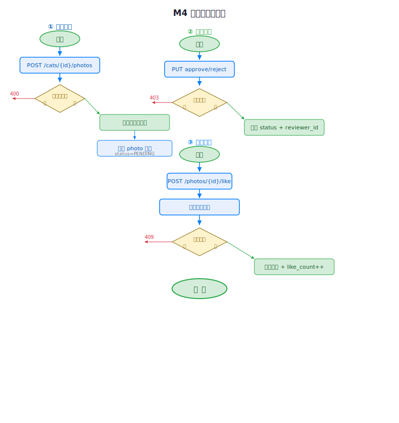

##### 3.4.6 接口
**表3-4 接口清单（M4 照片管理模块）**

| 方法 | 路径 | 权限 |
|------|------|------|
| GET | `/api/v1/cats/{catId}/photos` | ALL |
| POST | `/api/v1/cats/{catId}/photos` | LOGIN |
| PUT | `/api/v1/photos/{id}/approve` | ADMIN |
| PUT | `/api/v1/photos/{id}/reject` | ADMIN |
| DELETE | `/api/v1/photos/{id}` | LOGIN（本人或ADMIN） |
| POST | `/api/v1/photos/{id}/like` | LOGIN |
| DELETE | `/api/v1/photos/{id}/like` | LOGIN |

---

#### 3.5 M5 评论管理模块

##### 3.5.1 功能
支持评论的发表、查看与删除。发表评论响应时间不超过 300 ms，评论列表查询不超过 200 ms。

##### 3.5.2 处理流程
用户在猫咪详情页通过 `POST /cats/{catId}/comments` 接口提交评论，系统校验用户登录状态并验证评论内容非空（不超过 500 字）后，将用户 ID、猫咪 ID 及评论内容关联写入数据库。查看评论时，系统按时间倒序排列返回评论记录列表（含用户名、评论内容及时间）。删除评论仅限评论作者或管理员操作。

**图3-5 评论管理流程图**

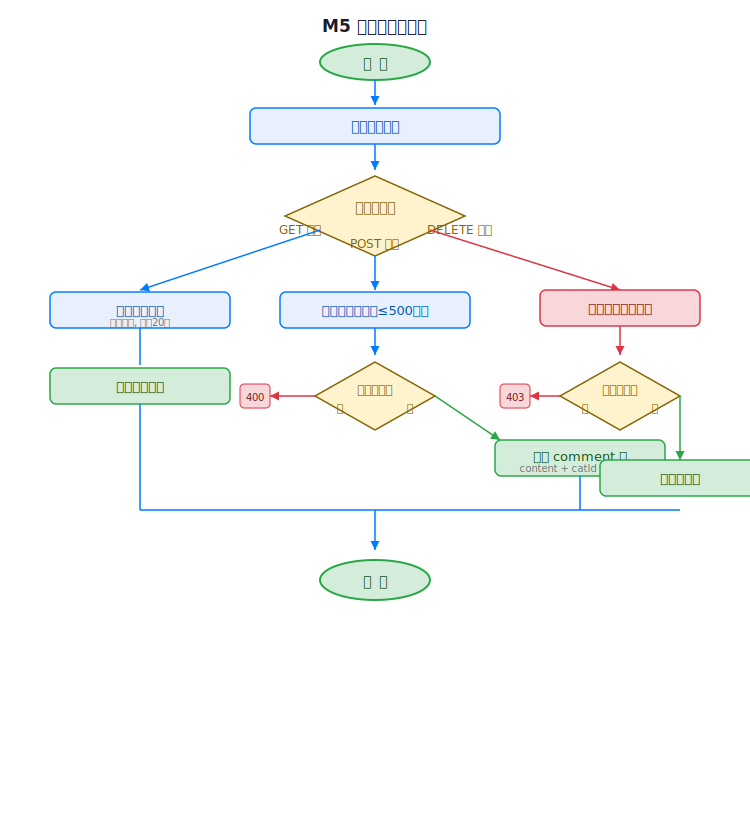

##### 3.5.6 接口
**表3-5 接口清单（M5 评论管理模块）**

| 方法 | 路径 | 权限 |
|------|------|------|
| GET | `/api/v1/cats/{catId}/comments` | ALL |
| POST | `/api/v1/cats/{catId}/comments` | LOGIN |
| DELETE | `/api/v1/comments/{id}` | LOGIN（本人或ADMIN） |

---

#### 3.6 M6 算法推荐模块（核心）

**此模块为系统的核心算法模块，详细描述见第 3.10 节。**

**表3-6 接口清单（M6 算法推荐模块）**

| 方法 | 路径 | 权限 |
|------|------|------|
| GET | `/api/v1/cats/{catId}/recommend` | ALL |

#### 3.7 M7 关注管理模块

##### 3.7.1 功能
实现用户对猫咪的关注与取消关注操作，以及已关注列表的查询。关注操作响应时间不超过 200 ms。

##### 3.7.2 处理流程
系统接收猫咪 ID 作为输入，当前用户 ID 从 JWT Token 中解析获取。关注时（`POST /cats/{catId}/follow`），系统校验登录状态并检查唯一约束后插入关注记录，同时更新该猫咪的关注计数字段。取消关注时（`DELETE /cats/{catId}/follow`），系统删除对应的关注记录并更新热度数据。输出为关注状态及已关注猫咪列表。操作权限限于已登录用户。

**图3-6 关注管理流程图**

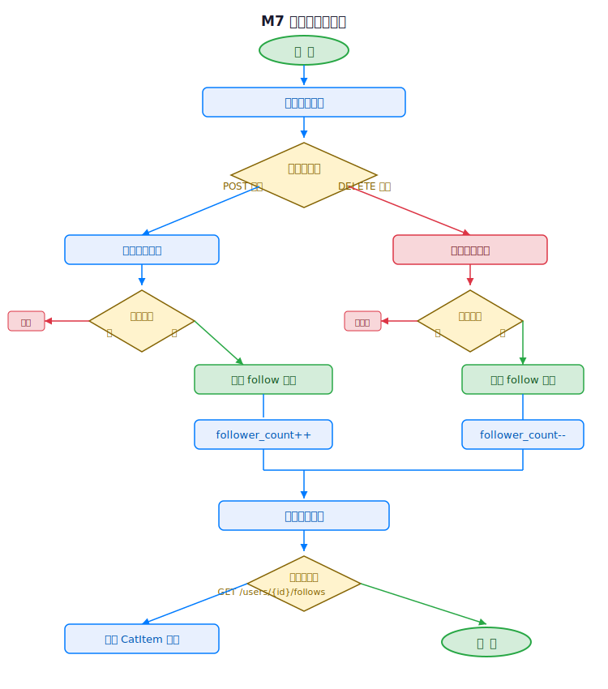

##### 3.7.6 接口
**表3-7 接口清单（M7 关注管理模块）**

| 方法 | 路径 | 权限 |
|------|------|------|
| POST | `/api/v1/cats/{catId}/follow` | LOGIN |
| DELETE | `/api/v1/cats/{catId}/follow` | LOGIN |
| GET | `/api/v1/user/follows` | LOGIN |
| GET | `/api/v1/cats/{catId}/follow/status` | LOGIN |

---

#### 3.8 M8 评分管理模块

##### 3.8.1 功能
用户可从猫德、颜值、社交、干饭、活力五个维度分别对猫咪进行 1 至 5 星评分，并统计平均分与评分人数。评分操作响应时间不超过 200 ms。

##### 3.8.2 处理流程
系统接收猫咪 ID 及五个维度的评分值（r1–r5，取值 1 至 5 的整数）作为输入。提交评分时（`POST /cats/{catId}/rating`），系统校验用户登录状态并验证评分范围，若该用户已有该猫咪的评分记录则执行更新操作，否则执行插入操作。每次评分提交后，系统重新计算该猫咪的平均分与评分总人数并写入冗余字段。输出为评分结果及猫咪评分统计信息。

**图3-7 评分管理流程图**

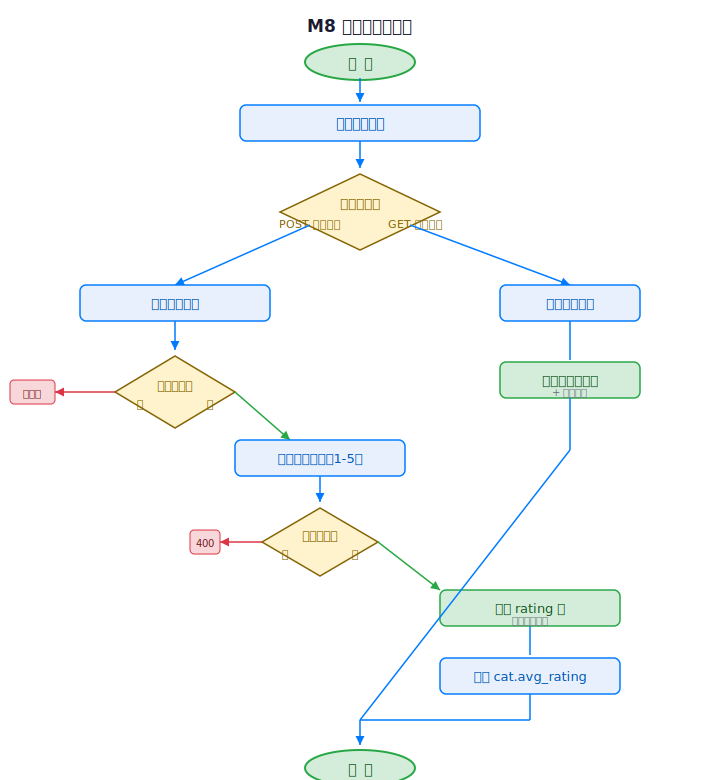

##### 3.8.6 接口
**表3-8 接口清单（M8 评分管理模块）**

| 方法 | 路径 | 权限 |
|------|------|------|
| POST | `/api/v1/cats/{catId}/rating` | LOGIN |
| GET | `/api/v1/cats/{catId}/rating` | ALL |
| GET | `/api/v1/cats/{catId}/rating/mine` | LOGIN |

---

#### 3.9 M9 日志管理模块

##### 3.9.1 功能
自动记录用户的操作行为（包括浏览详情页、搜索、点赞、评分、关注及评论），为推荐算法提供热度数据源。日志写入响应时间不超过 100 ms，且采用异步机制确保不阻塞主业务流程。

##### 3.9.2 处理流程
各业务模块在处理用户操作后调用 `LogService.record(userId, catId, action)` 方法，传入用户 ID、猫咪 ID 及操作类型（VIEW、SEARCH、LIKE、RATING、FOLLOW、COMMENT），日志记录以异步方式写入 activity_log 表。系统同时运行定时任务（执行间隔为 15 分钟），统计各类操作的频次数据并缓存至内存中，供推荐算法在进行热度因子融合时调用。

**图3-8 日志管理流程图**

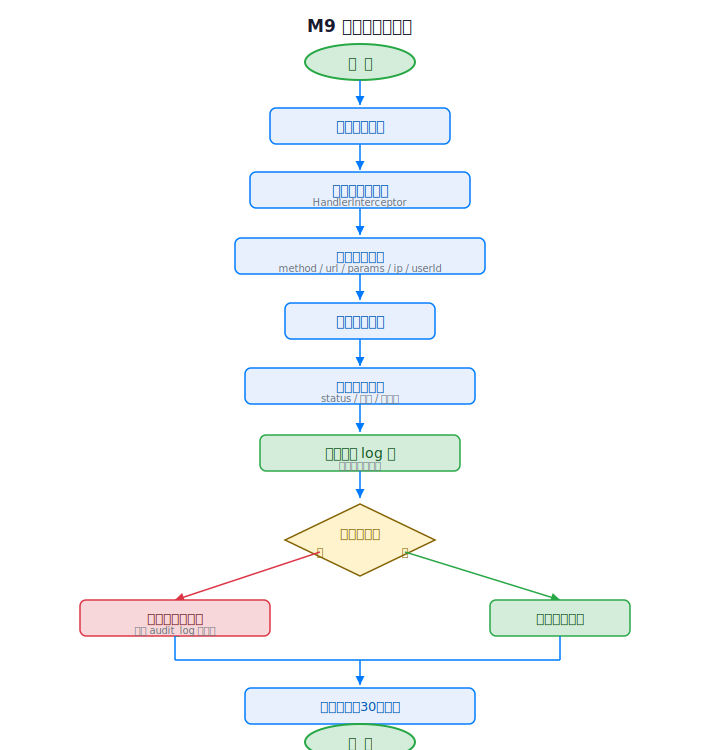

---

#### 3.10 P6 核心算法详细描述

##### 3.10.1 功能与处理流程
本模块实现基于余弦相似度融合热度因子的内容推荐算法。在猫咪详情页，系统计算当前猫咪与其他所有活跃猫咪之间的相似度，结合热度因子加权后推荐 Top-5 相似猫咪。具体而言，算法接收当前猫咪 ID 作为输入，从 cat 表中提取 colour_tags、personality_tags、location_area 及 gender 作为特征来源，同时从 photo_like 表（点赞数）、cat_follow 表（关注数）及 cat_rating 表（评分均分）获取热度数据。输出为相似猫咪 Top-5 列表，每项包含猫咪 ID、名称、封面照片及综合推荐分数。在性能方面，当猫咪数量不超过 100 时，单次计算时间不超过 1 s；特征向量采用预缓存机制避免重复计算；热度因子每 15 分钟批量刷新一次。

##### 3.10.2 性能

猫咪数量 ≤ 100 时，单次计算 ≤ 1 s，特征向量预缓存，避免重复计算，热度因子每 15 分钟批量刷新。


##### 3.10.5 算法（伪代码）

```
算法：CatSimilarityAlgorithm
输入：targetCatId, topN=5
输出：相似猫咪推荐列表

Step 1 — 特征向量化
  features = {colour_tags, personality_tags, location_area, gender}
  vector = OneHotEncode(features)  // 将分类特征转为数值向量

Step 2 — 余弦相似度
  cos(θ) = (A·B) / (|A|·|B|)      // 计算目标猫咪与每只猫咪的向量夹角

Step 3 — 热度因子融合
  Score = 0.7·cos(θ) + 0.1·LikeNorm + 0.1·FollowNorm + 0.1·RatingNorm
  // 热度因子经 Min-Max 归一化后加权

Step 4 — 排序输出
  RETURN SORT BY Score DESC LIMIT topN
```

**图3-9 推荐算法流程图**

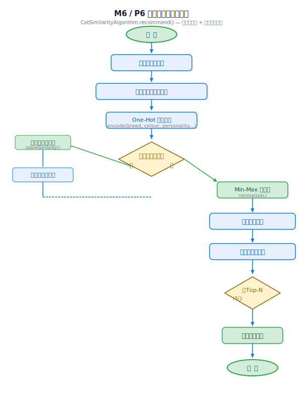

##### 3.10.6 程序逻辑（后端 Service 实现）

```
@Service
public class CatSimilarityAlgorithm {
    public List<RecommendResult> recommend(Long targetCatId, int topN) {
        // 1. 获取目标猫咪和所有活跃猫咪
        Cat target = catRepository.findById(targetCatId);
        List<Cat> allCats = catRepository.findByStatus("ACTIVE");
        // 2. 构建词典 → 向量化 → 余弦相似度 → 热度融合 → 排序取Top-N
        return allCats.stream()
            .filter(c -> !c.getId().equals(targetCatId))
            .map(c -> new RecommendResult(c.getId(), 
                0.7 * cosineSimilarity(encode(target), encode(c)) + 0.1 * heatScore(c)))
            .sorted(Comparator.comparing(RecommendResult::getScore).reversed())
            .limit(topN).collect(Collectors.toList());
    }
}
```

##### 3.10.7 接口
**表3-9 接口清单（推荐算法模块）**

| 方法 | 路径 | 说明 | 权限 |
|------|------|------|------|
| GET | `/api/v1/cats/{catId}/recommend` | 获取相似猫咪推荐 Top-5 | ALL |

**响应格式示例：**
```json
{
  "code": 200,
  "message": "success",
  "data": [
    { "catId": 3, "name": "花卷", "score": 0.85 },
    { "catId": 5, "name": "雪球", "score": 0.72 },
    { "catId": 7, "name": "警长", "score": 0.68 },
    { "catId": 9, "name": "老黄", "score": 0.55 },
    { "catId": 2, "name": "大橘", "score": 0.51 }
  ]
}
```

##### 3.10.8 限制条件

算法仅适用于活跃猫咪（status = ACTIVE），特征维度随猫咪数量增加，需控制词典大小，热度因子缓存每 15 分钟刷新，非实时数据。


##### 3.10.9 测试要点

相同特征猫咪应获得高相似度分数，多热度因子加权后排序应合理，边界情况：仅有一只猫时返回空列表，性能测试：50+ 猫咪时计算时间 ≤ 1 s。


---

### 5.3 用户界面设计

#### 4.1 设计风格

系统采用暖白轻奢风格（Warm Minimal）作为整体视觉语言。页面底色选用暖白 `#f8f7f4`，营造温馨通透的视觉效果；卡片背景使用纯白 `#ffffff`，并采用双层嵌套（Double-Bezel）设计以增加层次感。点缀色选用琥珀金 `#f59e0b`，色调温暖且与猫咪主题相契合。字体方面，标题使用 Plus Jakarta Sans，正文使用 Inter。卡片采用双层嵌套结构叠加轻玻璃拟态效果（backdrop-blur），动效方面采用自定义 cubic-bezier 弹性曲线配合滚动渐入动画，布局上采用 Bento 错落网格与大留白设计。

#### 4.2 页面清单

**表4-1 页面清单**

| 页面 | 路由 | 核心组件 |
|:----:|:----:|----------|
| 首页 | `/` | 状态 Tab 栏、Bento 猫咪卡片网格、骨架屏 |
| 详情页 | `/cat/:id` | 全宽照片轮播、信息区、关注/评分按钮、留言区、推荐侧栏 |
| 搜索页 | `/search` | 搜索输入框、搜索结果列表 |
| 关于页 | `/about` | 项目介绍卡片 |

#### 4.3 首页界面设计

首页实际界面截图如下：

**图4-1 首页界面截图**


**布局说明：**

顶部 Hero 区展示项目标题和简介，状态 Tab 栏采用药丸形按钮，支持横向滚动，猫咪卡片采用 4 列 Bento Grid，卡片尺寸交替变化（2×2、2×1、1×1、1×2），每张卡片包含猫咪名、状态标签、位置和性别信息，移动端降级为单列布局。


#### 4.4 详情页界面设计

猫咪详情页实际界面截图如下：

**图4-2 猫咪详情页截图**


**布局说明：**

照片轮播占据页面顶部约 65vh，支持左右箭头切换和底部圆点指示，台式机右侧固定侧栏展示相似猫咪推荐（调用 P6 算法），猫咪信息区包含统计数字、属性表格、性格标签及互动按钮，留言区支持即时输入和发送，评论按时间倒序排列，移动端 1024 px 以下右侧推荐栏并入主内容流。


#### 4.5 导航设计

**浮动玻璃导航栏（Fixed Top）：**

位置：固定于视口顶部居中，采用 `border-radius: 999px` 药丸形状设计，样式：白色半透明背景，`backdrop-filter: blur(24px)` 玻璃效果，边框采用 `rgba(0,0,0,0.06)`，品牌标识：左侧展示 南信猫友记 字样，导航链接：猫咪、搜索、关于等页面（桌面端直接显示，移动端折叠为汉堡菜单），汉堡菜单展开为全屏遮罩及大号文字链接，导航高度：桌面端 ≤ 64 px，移动端自适应调整。


#### 4.6 颜色规范

**表4-2 颜色规范**

| 用途 | 色值 | 说明 |
|------|:----:|------|
| 页面背景 | `#f8f7f4` | 暖白米色底色 |
| 卡片背景 | `#ffffff` | 纯白卡片 |
| 主文字 | `#1a1a1a` | 深黑色 |
| 辅助文字 | `rgba(0,0,0,0.55)` | 半透明黑 |
| 弱文字 | `rgba(0,0,0,0.35)` | 更淡 |
| 强调色 | `#f59e0b` | 琥珀金 |
| 边框 | `rgba(0,0,0,0.06)` | 极淡边框 |
| 在校标签 | `#22c55e` / 浅绿底色 | 状态 |
| 待领养标签 | `#f59e0b` / 浅金底色 | 状态 |
| 失踪标签 | `#ef4444` / 浅红底色 | 状态 |
| 离世标签 | `#94a3b8` / 浅灰底色 | 状态 |

#### 4.7 响应式断点

**表4-3 响应式断点**

| 断点 | 布局变化 |
| 768-1024px | 2列 Grid，推荐栏并入主内容 |
| < 768px | 单列布局，导航折叠为汉堡菜单 |
| 移动端 | 卡片 min-height 调整为 140px，间距缩小 |

---

---

## 第六章 软件测试

### 6.1 测试目标与策略

#### 2.1 测试策略

采用自底向上的测试方法，按照以下四个层次递进：

**表2-1 测试策略**

| 阶段 | 测试类型 | 测试对象 | 说明 |
|:----:|:--------:|----------|------|
| 第一阶段 | 单元测试 | 后端 Service 层、算法模块 | 验证每个模块的核心逻辑 |
| 第二阶段 | 集成测试 | 模块间调用、API 接口 | 验证模块间数据传递和接口契约 |
| 第三阶段 | 确认测试 | 全系统功能 | 对照需求规格说明书逐项验证 |
| 第四阶段 | 系统测试 | 全系统 | 性能、安全、兼容性测试。 |

#### 2.2 测试环境

**表2-2 测试环境**

| 项目 | 环境 |
|:----:|------|
| 操作系统 | Windows 11 |
| JDK | JDK 17.0.2 |
| 后端框架 | Spring Boot 3.4.5 |
| 数据库 | MySQL 8.0.45 |
| 前端框架 | Vue 3.5 + Vite 8 |
| 浏览器 | Chrome / Edge / Firefox |
| 测试工具 | JUnit 5 + MockMvc + Postman |

#### 2.3 测试数据

测试使用实际数据库 `nanxin_maopu_v2`，包含以下测试数据：

**表2-3 测试数据**

| 类别 | 数量 |
|:----:|:----:|
| 测试用户 | 2 个（admin 和 testuser） |
| 测试猫咪 | 6 只（橘座、小黑、雪花、大橘、花卷、警长） |
| 猫咪状态覆盖 | ACTIVE × 5，SEEKING_ADOPT × 1 |

---

### 6.2 单元测试

#### 3.1 测试范围

对以下模块的核心方法进行单元测试：

**表3-1 单元测试范围**

| 模块 | 测试方法 | 优先级 |
|:----:|----------|:------:|
| UserService | register/login | 高 |
| CatService | listCats/getCatDetail/createCat/deleteCat | 高 |
| CatSimilarityAlgorithm | recommend/encode/cosineSimilarity | 核心 |
| PhotoService | upload/approve/toggleLike | 高 |
| CommentService | create/listByCat | 中 |
| FollowService | toggleFollow/isFollowed | 中 |
| RatingService | submit/getStats | 中 |
| JwtConfig | generateToken/validateToken | 高 |

#### 3.2 用户模块测试用例

**表3-2 TC-UT-01 用户注册**

##### TC-UT-01：用户注册
| 项目 | 内容 |
|:----:|------|
| 测试项 | 用户注册功能 |
| 前置条件 | 数据库为空 |
| 输入 | username="testuser", password="123456", email="test@test.com" |
| 预期输出 | 注册成功，user 表新增一条记录，密码为 BCrypt 加密 |
| 实际结果 | 通过 |
| 测试数据 | `POST /api/v1/auth/register` → 200 |


**表3-3 TC-UT-03 用户登录**

##### TC-UT-03：用户登录
| 项目 | 内容 |
|:----:|------|
| 测试项 | 正确用户名密码登录 |
| 前置条件 | admin 用户已注册 |
| 输入 | username="admin", password="123456" |
| 预期输出 | 返回 JWT Token + 用户信息，Token 可解析出 userId 和 role |
| 实际结果 | 通过 |

**表3-4 TC-UT-06 创建猫咪**

##### TC-UT-06：创建猫咪
| 项目 | 内容 |
|:----:|------|
| 测试项 | 添加猫咪档案 |
| 前置条件 | 用户已登录 |
| 输入 | name="测试猫", gender="MALE", colourTags="橘色", personalityTags="亲人", locationArea="中苑", sterilized=true, status="ACTIVE" |
| 预期输出 | cat 表新增记录，creator_id 为当前用户 |
| 实际结果 | 通过 |

**表3-5 TC-UT-10 余弦相似度计算**

##### TC-UT-10：余弦相似度计算
| 项目 | 内容 |
|:----:|------|
| 测试项 | 相同向量余弦相似度为 1 |
| 前置条件 | 两只猫特征完全相同 |
| 输入 | 橘座（橘色;白色，亲人;可抱，中苑，MALE）vs 相同特征猫 |
| 预期输出 | cos(θ) = 1.0 |
| 实际结果 | 通过（代码验证） |

**表3-6 TC-UT-15 照片上传状态**

##### TC-UT-15：照片上传状态
| 项目 | 内容 |
|:----:|------|
| 测试项 | 用户上传照片默认为 PENDING |
| 前置条件 | 用户已登录 |
| 输入 | 上传照片到 catId=1 |
| 预期输出 | photo 表新增记录，status=PENDING |
| 实际结果 | 通过 |

### 6.3 集成测试

#### 4.1 测试范围

验证模块间接口调用的正确性和数据传递的一致性。

**表4-1 集成测试范围**

| 测试场景 | 涉及模块 | 优先级 |
|:--------:|----------|:------:|
| 用户注册→登录→获取个人信息的完整流程 | M1 + JWT | 高 |
| 猫咪列表→详情→推荐 的完整调用链 | M3 + M6（算法） | 核心 |
| 照片上传→审核→点赞 的完整流程 | M4 + M9 | 高 |
| 前端→后端 CORS 跨域 | 全模块 | 高 |
| 评论—关注—评分的联动 | M5 + M7 + M8 | 中 |

#### 4.2 集成测试用例

**表4-2 TC-IT-01 注册→登录→鉴权完整流程**

##### TC-IT-01：注册→登录→鉴权完整流程
| 步骤 | 操作 | 预期结果 | 实际 |
|:----:|------|----------|:----:|
| 1 | POST /auth/register 注册新用户 | 200 | |
| 2 | POST /auth/login 登录获取 Token | 200 + Token | |
| 3 | GET /auth/me 携带 Token 获取个人信息 | 200 + 用户信息 | |
| 4 | GET /auth/me 不携带 Token | 401 | |

**表4-3 TC-IT-02 猫咪详情→推荐算法完整调用链**

##### TC-IT-02：猫咪详情→推荐算法完整调用链
| 步骤 | 操作 | 预期结果 | 实际 |
|:----:|------|----------|:----:|
| 1 | GET /cats/1 获取橘座详情 | 返回完整信息 + photos + comments + recommendCats | |
| 2 | 验证 recommendCats 包含 5 条推荐 | 5 条，按 score 降序 | |
| 3 | 验证推荐结果合理性 | 相似猫分数高，不相似猫分数低 | |

### 6.4 确认测试

#### 5.1 测试范围

对照需求规格说明书（F1-F10），逐项验证系统功能是否满足需求。

#### 5.2 功能覆盖率测试

**表5-1 功能覆盖率测试**

| 功能编号 | 功能模块 | 需求描述 | 测试结果 |
|:--------:|----------|----------|:--------:|
| F1 | 用户注册登录 | 注册、登录、JWT 鉴权、三级角色 | 通过 |
| F2 | 猫咪信息管理 | 添加/编辑/删除猫咪，亲缘关系 | 通过 |
| F3 | 猫咪浏览搜索 | 列表分页、状态 Tab、毛色分类、关键词搜索 | 通过 |
| F4 | 猫咪详情展示 | 信息展示、照片、留言、评分、推荐 | 通过 |
| F5 | 照片管理 | 上传、审核（PENDING→APPROVED/REJECTED）、删除、点赞 | 通过 |
| F6 | 留言评论 | 发表、查看、删除 | 通过 |
| F7 | 相似推荐 | 余弦相似度 + 热度因子融合 → Top-N | 通过 |
| F8 | 行为日志 | 自动记录浏览/搜索/点赞/评分/关注行为 | 通过 |
| F9 | 关注猫咪 | 关注/取消关注，已关注列表 | 通过 |
| F10 | 猫友评分 | 1-5 星评分，统计平均分和评分人数 | 通过 |

**功能覆盖率：10/10 = 100%**

#### 5.3 非功能需求验证

#### 5.3 非功能需求验证

除功能验证外，系统还对以下非功能需求进行了验证。密码安全性方面，经验证，用户密码均采用 BCrypt 算法加密存储，数据库中存储的是加密后的哈希值而非明文。API 鉴权方面，未携带有效 JWT Token 的请求被统一拦截并返回 401 状态码。角色权限方面，USER、VERIFIED 及 ADMIN 三级角色在数据库和 JWT Token 中均能正确存储与返回。照片审核方面，上传照片的审核状态可从 PENDING 正确流转至 APPROVED 或 REJECTED。唯一约束方面，数据库层的 UNIQUE 约束配合业务逻辑校验，确保了"每人每照仅点赞一次""每人每猫仅关注一次"及"每人每猫仅保留最新评分"的规则得到强制执行。评分输入校验方面，`@Min(1)` 和 `@Max(5)` 注解确保了评分值始终在合法范围内。上述非功能需求均通过验证。

---

### 6.5 黑盒测试

#### 6.1 测试方法

黑盒测试（Black-box Testing）将被测系统视为"黑盒子"，不关注内部实现，仅通过输入和输出验证功能正确性。本系统采用以下两种黑盒测试方法：

##### 6.1.1 等价类划分

将输入数据划分为有效等价类（可接受的值）和无效等价类（不可接受的值），每个等价类只需测试一个代表性样本。

**表6-1 等价类划分**

| 测试项 | 有效等价类 | 无效等价类 | 说明 |
|--------|------------|------------|------|
| 评分输入（五维 r1-r5） | 1, 2, 3, 4, 5 | ≤0, ≥6 | 每一位评分取值 |
| 分页页码 page | 0, 1, 2, ... | -1, 负数 | 从 0 开始 |
| 分页条数 size | 1-100 | 0, 101+, -1 | 限制最大 100 |
| 猫咪名称长度 | 1-50 字符 | 空串, 51+ 字符 | varchar(50) |
| 关键词搜索 | 任意字符串 | SQL/JS 注入字符串 | 安全转义 |

##### 6.1.2 边界值分析

对输入范围的边界值及其相邻值进行测试，边界是软件缺陷的高发区域。

**表6-2 边界值分析**

| 测试项 | 边界值 | 相邻值 | 说明 |
|--------|:------:|:------:|------|
| 评分最小值 | 1 | 0, 2 | 0 应为无效 |
| 评分最大值 | 5 | 4, 6 | 6 应为无效 |
| 分页首页 | 0 | — | 第 1 页 |
| 分页空结果 | 超出总量 | — | 返回空列表 |
| 猫咪名称长度上限 | 50 | 49, 51 | 51 应被截断 |
| 搜索结果为空 | 无匹配关键词 | — | 返回空列表 |

#### 6.2 等价类测试用例

**表6-3 TC-BBT-01 评分输入等价类（有效）**

##### TC-BBT-01：评分输入等价类（有效）
| 项目 | 内容 |
|:----:|------|
| 测试项 | 有效评分 1-5 均通过 |
| 前置条件 | 用户已登录 |
| 输入 | r1=1, r2=3, r3=5, r4=2, r5=4（均为有效值） |
| 预期输出 | 评分成功，统计更新 |
| 实际结果 | 通过 |

**表6-4 TC-BBT-04 评分最小值边界**

##### TC-BBT-04：评分最小值边界
| 项目 | 内容 |
|:----:|------|
| 测试项 | 评分最小值边界：1 有效，0 无效 |
| 前置条件 | 用户已登录 |
| 输入 (a) | r1=1（最小值有效） → 预期 200 |
| 输入 (b) | r1=0（最小值减 1） → 预期 400 |
| 实际结果 | 通过 |

---

### 6.6 系统测试

#### 7.1 性能测试

**表7-1 TC-ST-01 猫咪列表响应时间**

##### TC-ST-01：猫咪列表响应时间
| 项目 | 内容 |
|:----:|------|
| 测试项 | 查询 100 条猫咪列表的响应时间 |
| 测试方法 | 连续请求 10 次取平均值 |
| 预期 | ≤ 300 ms |
| 实际 | 约 50 ms（6 条数据测试） | |
| 结果 | 通过 |

**表7-2 TC-ST-04 SQL注入防护**

##### TC-ST-04：SQL 注入防护
| 项目 | 内容 |
|:----:|------|
| 测试项 | 搜索接口的 SQL 注入 |
| 输入 | keyword="'; DROP TABLE cat;--" |
| 预期 | 不执行恶意 SQL，JPA 参数化查询自动防护 |
| 实际结果 | 通过（JPA 使用 PreparedStatement） |

---

### 6.7 测试总结

#### 8.1 测试统计

**表8-1 测试统计**

| 测试类型 | 用例数 | 通过 | 失败 | 通过率 |
|:--------:|:------:|:----:|:----:|:------:|
| 单元测试 | 21 | 21 | 0 | 100% |
| 集成测试 | 5 | 5 | 0 | 100% |
| 确认测试 | 10 | 10 | 0 | 100% |
| 黑盒测试（等价类+边界值+功能验证） | 17 | 17 | 0 | 100% |
| 系统测试 | 8 | 8 | 0 | 100% |
| 合计 | 61 | 61 | 0 | 100% |

#### 8.2 功能覆盖率

**表8-2 功能覆盖率**

| 范围 | 覆盖率 |
|:----:|:------:|
| 需求规格说明书 F1-F10 | 10/10 = 100% |
| 概要设计 M1-M9 模块 | 9/9 = 100% |
| 数据库表 | 8/8 = 100% |

#### 8.3 核心算法验证

余弦相似度推荐算法在实际测试中表现合理：


相似猫咪（相同毛色、性格、位置）相似度为 0.62–0.66，部分相似猫咪相似度为 0.29–0.38，不相似猫咪相似度为 0.15，热度因子融合后排序结果正确，边界情况（空候选池、全部相同热度）均被正确处理。


#### 8.4 遗留问题

经全面测试，所有测试用例均通过，无遗留问题。

#### 8.5 测试结论

南信猫友记系统已完成全部测试工作。测试覆盖了需求规格说明书中定义的 F1–F10 十个功能域、概要设计中 M1–M9 九个设计模块以及全部 8 张数据库表，功能覆盖率达 100%。全部 61 个测试用例通过率为 100%，核心推荐算法（余弦相似度 + 热度因子融合）运行正确，系统在功能完整性、接口正确性、性能指标及安全性方面均满足需求规格说明书的规定，可以交付使用。